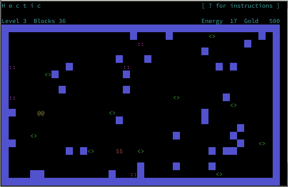
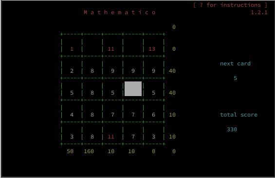
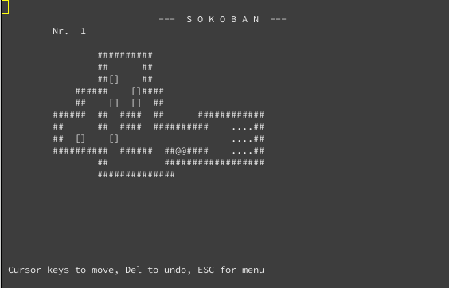

# Games

Various little games, I used to learn and play with programming languages

To build a game call *make* in a subdirectory. Maybe read the prerequisites
in *Makefile* first.

## Hectic

A maze running game. Collect prices and don't bump into obstacles and walls.

You are ``@@``.

You must run around a room using the curser keys and collect items:

* ``<>`` is worth 10 Gold
* ``::`` is worth 20 Gold
* ``$$`` is worth 50 Gold

After you start running you can't stop anymore.

You must not run into the walls or into boxes. If you do, your energy decreases.

If your energy runs out, the game is over.

When you have collected all items, a new, more cluttered room is generated
and you start over with 10 more energy points.

## Mathematico

A card laying game. Place cards on a grid similar to Poker.

To score you can place the numbers in any row or any column or in any of the two diagonals.

Cards            | Score
-----------------|------
One Pair         |   10
Two Pairs        |   20
Three In A Row   |   40
Street           |   50
Full House       |   80
1 1 1 13 13      |  100
1 10 11 12 13    |  150
Four In A Row    |  160
1 1 1 1          |  200

add 10 points to each diagonal score

## Sokoban

The classical Sokoban game. Text based and with undo.

## more to come ...

* graphical Mathematico (in Ada)